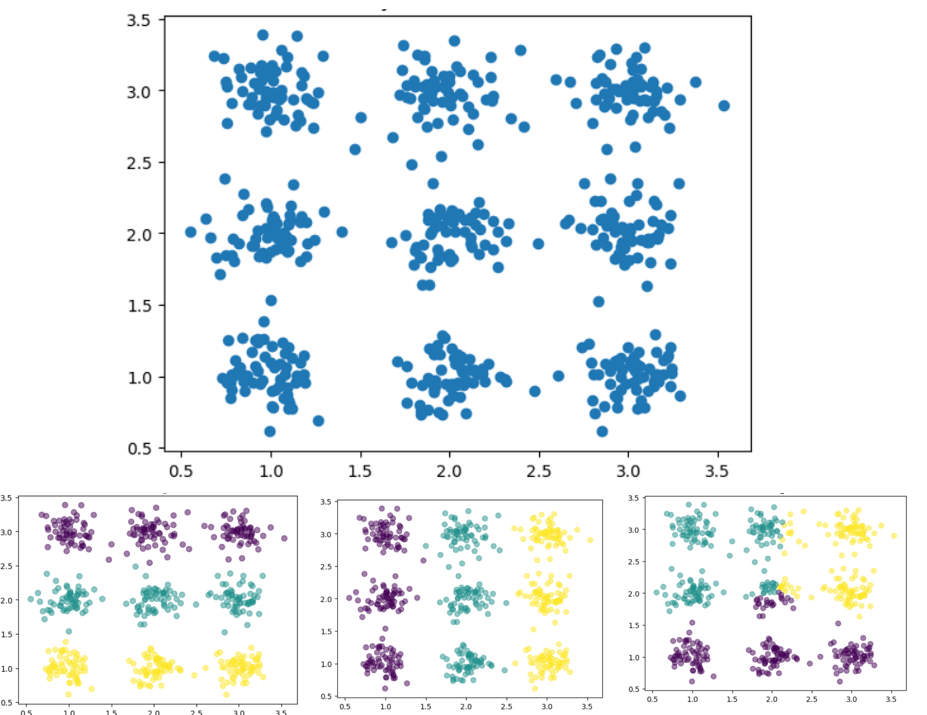
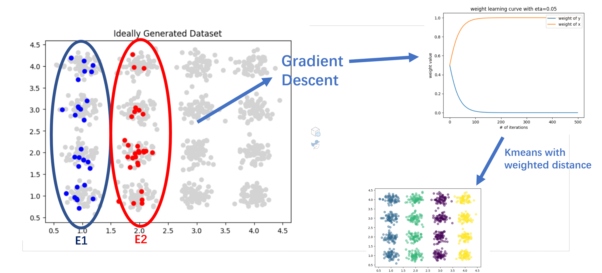

## Problem Statement

Clustering is an unsupervised machine learning algorithm. There does not exist an optimal clustering result. For example, the following dataset can be clustered in multiple ways: by rows, by columns, or by squarish shapes. 

The aim of Directed Kmeans is to improve the maneuverability of shape and distribution of clusters. Given partial information of cluster formations, we want to extrapolate the shape and distribution of clustered data points to unclusterd dataset. 

## Algorithm

Standard Kmeans algorithm uses regular Euclidean distance metric. In Directed Kmeans, weighted Euclidean distance metric is used to change the shape and distribution of clusters. In the graph above, the first clustering by row is achieved through weighing y-axis over x-axis; the second clustering by column is achieved through weighing $x$-axis over $y$-axis; the third is unweighted clustering.

We also present the following algorithm to learn the weights in weighted Euclidean distance based on the partially given information of cluster formations. Suppose we know $q$ sets $(E_i)_{1 \leq i\leq q}$ where each set $E_i$ stores a known cluster. We want our distance metric to minimize the distance between pairs of elements in the same known cluster, so the cost function and its gradient is is given as 

$$
J(w)=\sum_{i=1}^q\sum_{a,b \in E_i}\sqrt{(x_a-x_b)^2w}
$$

$$
\frac{\partial J}{\partial w}=\sum_{i=1}^q\sum_{a,b \in E_i} \frac{(x_a-x_b)}{\sqrt{(x_a-x_b)^2 w}}
$$

and through gradient descent we will be able to identify an optimal set of weights $w$.

However, we want to keep the sum of weights constant, or else the above algorithm is likely to converge to a zero vector as $w$. Thus, we introduce a latent variable $g$ such that $w=\text{softmax}(g)$, and the training algorithm is as follows:

1. Calculate the weight using the softmax function: $w = \text{softmax}(g)$. 
2. Compute the gradient of the objective function with respect to the weight: 

$$
\frac{\partial J}{\partial w} = \sum_{i=1}^q \sum_{a,b \in E_i} \frac{(x_a - x_b)}{\sqrt{(x_a - x_b)^2 w}}
$$

3. Compute the gradient of the weight with respect to $g$ and update the parameter $g$ using the learning rate $\eta$:

$$
\frac{\partial w}{\partial g} = w(1 - w)
$$

$$
g := g - \eta \frac{\partial J}{\partial w} \frac{\partial w}{\partial g}
$$

4. Repeat steps 1-4 until convergence.

Here is a visualized overview of this process

